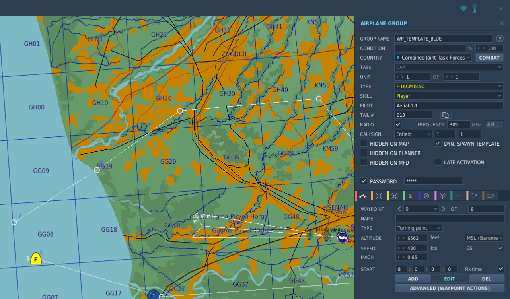
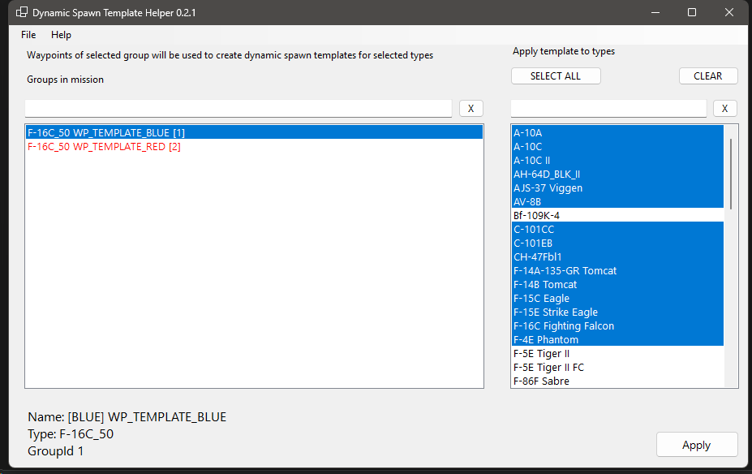
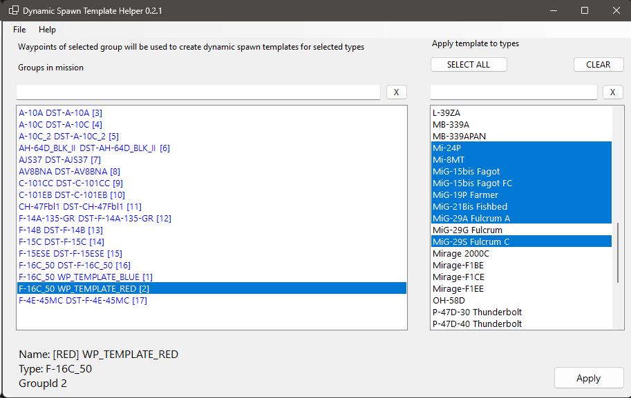
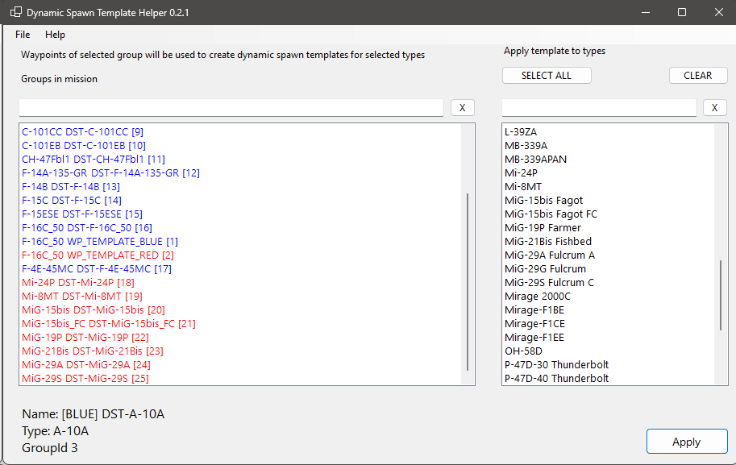
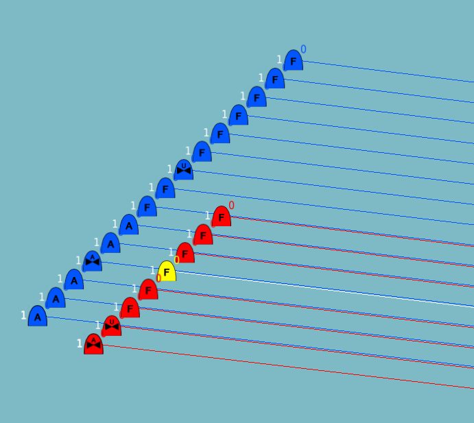
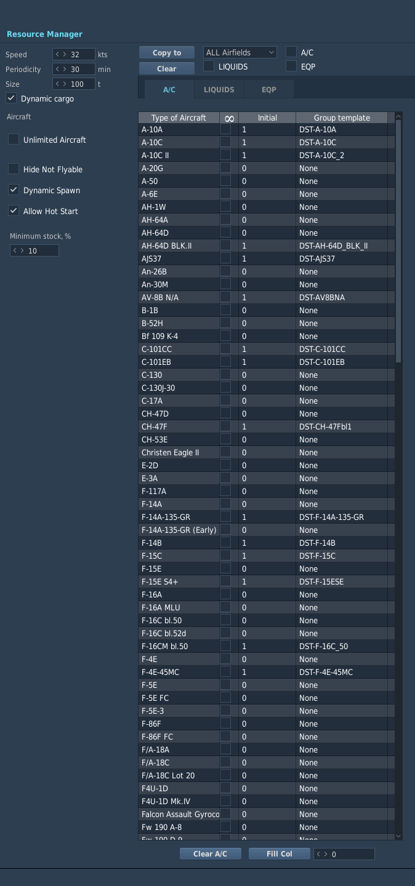

## Waypoint / Point-of-interest creation via Dynamic Spawn Utility

Dynamic Spawn Utility is a tool which enables mission designers to set up a common waypoint layout for all players. While this is achievable using DCS mission editor, it is a tedious and time consuming process.
Dynamic Spawn Utility cuts the time from hour(s) to a few seconds!
Benefit of common waypoints layout for all players is that it is much easier to reference objectives and coordinate among players in dynamic multiplayer sessions using a common waypoint system. Another benefit is better user experience since you as a player *won't have to* set up a flight plan for each sortie, you can just set your steerpoint number to mission objective.

It is highly recommended that mission coalitions include "countries" *Combined Joint Task Force Red* and *Combined Joint Task Force Blue*.

To set up common waypoints, do the following:

### Create master template for red and blue coalition in DCS Mission Editor

1. Create blue aircraft group with country set to "Combined Joint Task Force Blue" (exact airframe does not matter but it *must be a flyable module*). Tip: it is recommended to have the group's initial position somewhere far off the map's detailed "playable" area to avoid cluttering
2. give a recognizable name to the group e.g. WPT\_TEMPLATE\_BLUE 
3. set group skill level to *Player* and tick DYN. SPAWN TEMPLATE checkbox 
4. add password to group as we do not want players to actually spawn as our group 
5. add a waypoint for each point of interest on your map 
6. Copy and paste the group and change its coalition/country to red/Combined Joint Task Force Red, name the groups something you'll recognize like "WP\_TEMPLATE\_RED" 
7. Save your mission

### Use the Dynamic Spawn Utility to apply waypoints to dynamic spawn templates

1. Click File on the menu and select your mission file
2. Select your blue waypoint template group in the list on the left side.
3. Select blue coalition airframes you want the waypoints to be applied to on the right side, use SHIFT and CTRL keys for multiple selection.
4. Apply template by clicking Apply button
5. Repeat the steps 1-4 for red coalition

Congratulations, you are done!
Dynamic Spawn Utility will add a template group for every aircraft type you selected and apply the template group to every airfield and FARP

|  |  |  |
|----|----|----|
|  WP_TEMPLATE_BLUE will be applied to selected types  | WP_TEMPLATE_RED will be applied to selected types  | End result after template has been applied to red and blue |

Dynamic Spawn Utility will generate dynamic template groups and assign those as templates to dynamic spawns (warehouses) so when a player picks an aircraft from dynamic spawn

|||
|----|----|
|   | |

### Additional tips

Dynamic spawn utility will back up your mission, keep it if you want to change the layout of the waypoints in the future as it is easier to start without having to clear all the changes Dynamic Spawn Utility will make (one group per airframe and every airfield/warehouse inventory configuration)
